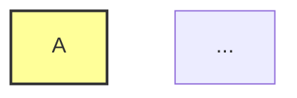

Our "Active Whiteboard" design isn't just for boxes and text—it extends to our diagrams too! By combining **Mermaid.js** with some CSS magic and the **Kalam** font, we turn rigid technical charts into friendly, hand-drawn sketches.

Here is how you can create beautiful, colorful diagrams that fit right into this aesthetic.

## 1. The "Sketchy" Flowchart

We can use Mermaid's styling syntax to add splashes of color to our nodes, making them pop like sticky notes.

<Mermaid code={`
graph TD
    A[Start Idea] --> B{Is it bold?}
    B -- Yes --> C[Prototype]
    B -- No --> D[Rethink]
    C --> E{Works?}
    E -- Yes --> F[Ship It!]
    E -- No --> D

    %% Styling Nodes
    style A fill:#ff9,stroke:#333,stroke-width:2px
    style C fill:#9f9,stroke:#333,stroke-width:2px
    style F fill:#99f,stroke:#333,stroke-width:2px,stroke-dasharray: 5 5
    style D fill:#f99,stroke:#333,stroke-width:2px
`} />

## 2. Colorful Sequence Diagram

Sequence diagrams are great for showing interactions. Our global theme automatically handles the colors, but you can still highlight specific participants.

<Mermaid code={`
sequenceDiagram
    autonumber
    participant U as User
    participant A as App
    participant S as Server

    U->>A: Click "Login"
    activate A
    A->>S: Validate Credentials
    activate S
    Note right of S: Checks Database...
    S-->>A: Token Received
    deactivate S
    A-->>U: Redirect to Dashboard
    deactivate A

    rect rgb(200, 255, 200)
        Note over U,A: Successful Login Flow
    end
`} />

## 3. Mindmap for Brainstorming

Mindmaps look exceptionally good with the hand-drawn font.

<Mermaid code={`
mindmap
  root((CivicThesis))
    Design
      Hand-drawn
      Accessible
      Responsive
    Tech Stack
      Astro
      Mermaid
      Chart.js
    Content
      Blog
      Tutorials
      Showcase
`} />

## 4. Dark Mode Adaptation

Try toggling the theme button in the top right! 

Our Mermaid configuration listens to the site's theme. 
- **Light Mode**: Uses white/paper backgrounds and dark ink.
- **Dark Mode**: Switches to dark backgrounds with light chalk-like lines.

This ensures your diagrams are always readable and beautiful, no matter the user's preference.
